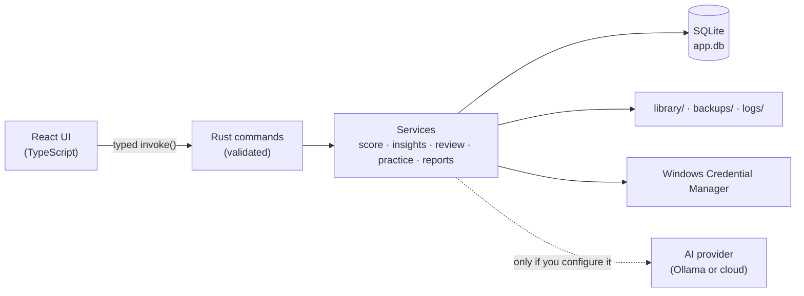

<div align="center">


# Hello World

**A journal for new coders.**

*Log what you learned. Practise it. See that struggle is followed by progress.*

[](#-getting-started)
[](https://tauri.app)
[](src-tauri)
[](src)
[](tsconfig.json)
[](#-privacy)

</div>

---

## 💡 Why

New coders start with high motivation, copy tutorials for a few days, and quit
around day 3. **Hello World** makes the learning loop visible:

<table>
<tr>
<td width="33%" valign="top">

### 📝 Log
What you learned today, **in your own words**. A full day takes under two minutes.

</td>
<td width="33%" valign="top">

### 🧩 Practise
Problems generated **only from concepts you know**, using ChatGPT, Gemini or a local model.

</td>
<td width="33%" valign="top">

### 🌱 Reflect
How it felt, and **proof** that the hard days were followed by breakthroughs.

</td>
</tr>
</table>

There's no code editor or compiler inside. You code wherever you already do;
Hello World tracks time, concepts, problems and feelings.

## ✨ Features

| | |
|---|---|
| ⏱️ **Session & problem timers** | Pause, resume, crash recovery. Late-night sessions count toward the previous day. |
| 🙂 **Mood check-ins** | Before and after every session, on a 1–5 scale from *Drained* to *Fired up*. |
| 📓 **Diary** | Feeling tags, with automatic links to the concepts you wrote about. |
| 📊 **Usefulness score** | A calculated score next to your own rating; time alone never makes a perfect day. |
| 📈 **Dashboard** | Streaks, heatmap, mood vs usefulness, and solved problems split into **alone · with help**. |
| 🔁 **Spaced review** | Concepts come back at 1 → 3 → 7 → 14 → 30 → 60 days. |
| 🤖 **Practice generator** | Copy-prompt mode (free), or Ollama / OpenAI-compatible / Gemini / Anthropic / OpenRouter. |
| 💬 **Insights** | *"You've been here before"*, comeback stories, a warning when you only watch tutorials, milestones. |
| 📚 **Library & roadmaps** | Your links, notes and files; roadmaps you build yourself or import. |
| ✉️ **Letters to future you** | Sealed until the day you choose. |
| 📄 **Reports** | A PDF, plus a Markdown report ready to paste into any chatbot. |

## 🔒 Privacy

- Everything lives in `%APPDATA%\app.helloworld.journal\`: your database, library, backups and logs.
- API keys are stored in the **Windows Credential Manager**, never in the database or the UI.
- Your diary text is **never** sent to an AI unless you turn that on.
- No telemetry. Nothing leaves the device unless you copy it, export it, or connect an AI model.

## 🚀 Getting started

**Prerequisites:** Node 20+, Rust (stable), and the
[Tauri prerequisites](https://tauri.app/start/prerequisites/) (MSVC C++ Build Tools + WebView2).

```sh
npm install
npm run tauri dev      # run the desktop app
npm run tauri build    # build the Windows installers (NSIS + MSI)
npm run dev            # UI only, in a browser, with an empty in-memory backend
```

The app always starts empty at onboarding. It never ships any sample data.

## 🏗️ Architecture



```
src/                      React UI
  core/types/api.ts       The IPC contract: every command, its args and result
  data/                   The only code that calls invoke()
src-tauri/
  migrations/             Forward-only SQL migrations (auto-backup before migrating)
  prompts/                Versioned prompt templates
  src/commands/           IPC entry points
  src/services/           Business logic, each testable on an in-memory DB
instructions/             The product specification
```

## ✅ Quality checks

```sh
npm run typecheck && npm test && npm run lint
cd src-tauri && cargo clippy --all-targets -- -D warnings && cargo test
```

A contract test (`src-tauri/tests/contract.rs`) fails if the UI's command list
and the Rust core ever disagree.

## 📦 Releases

Pushing a `v*` tag builds signed Windows installers through
`.github/workflows/release.yml`. Updates are signed with a private key kept
**outside** this repo (`~/.tauri/hello-world.key`). Add it as the
`TAURI_SIGNING_PRIVATE_KEY` repository secret. A Windows code-signing
certificate is recommended before a public release.

## 🧭 Decisions

- **Platforms:** Windows first; the code stays cross-platform.
- **Opening page:** the Dashboard, which you can change in Settings.
- **Milestones:** "solved on your own" and "solved with help" are tracked separately.
- **AI mode on first run:** Copy prompt, which is free and needs no setup.

<details>
<summary><b>Notes and deviations from the spec</b></summary>

- `api.ts` is a hand-written contract enforced by a Rust test, instead of being generated by `ts-rs`.
- Usefulness in charts is computed live with the v1 formula, so editing a past day never leaves stale numbers.
- Files and links open through `tauri-plugin-opener`, which replaces `shell.open` in Tauri 2.
- roadmap.sh: only a user-initiated import of a file the user downloaded themselves, stored with attribution.

</details>

---

<div align="center">

Made with care by **Sh@d**

</div>
